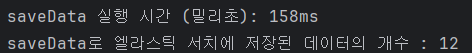

# 📋 프로젝트명 : Fastats

> 국가통계포털 KOSIS 검색 개선

## 🎨 데모

- 배포 URL : [https://k11a407.p.ssafy.io](https://k11a407.p.ssafy.io)
- Test ID : 없음
- Test PW : 없음

## 🚀 소개

1. 국가통계포털 내 통계에 대한 검색 결과를 정확하고, 더욱 빠르게 제공

2. 국가통계포털에서 제공하는 통계 목록 데이터를 전처리해서 DB화

3. 관련어 검색 및 검색어 자동완성

4. 자료의 목적을 말하면 키워드 혹은 통계 자료를 추천하는 챗봇

## ✨ 주요 기능

1. 약 25만 건의 통계표 데이터 전처리

2. Spring Scheduler와 Spring Batch를 활용한 데이터 최신화 로직

3. Elastic Search를 활용한 검색 기능 개선 (FULL-TEXT SEARCH)

4. 통계 목록 데이터에서 Chatbot 및 추천 모델 훈련을 위한 데이터셋 생성

5. 빌드-테스트 서버와 배포 서버 분리된 CI/CD

## 📄 사용 기술 스택

- **FE**: Next.js (w/ Typescript)
- **BE**: Spring Boot (w/ Java 17), Spring Scheduler, Spring Batch, Spring Data JDBC/Elasticsearch/JPA(비교용),
  Elasticsearch, Logstash, Kibana,
  MySQL, MongoDB, Redis
- **Infra**: Docker, Docker Compose, Docker Hub, Jenkins, NginX
- **AI** : Spring AI, Ollama

## 🔍 아키텍쳐

## 📈 향후 업데이트 계획

- **V2 기능 추가**: 더 나은 UX를 위한 새로운 기능들.
- **API 최적화**: 더 빠른 성능 제공.

## 🗒️ 느낀 점

| 팀원  | 느낀 점                                                                                                                                                                                                                                                                                                                                                                                      |
|-----|-------------------------------------------------------------------------------------------------------------------------------------------------------------------------------------------------------------------------------------------------------------------------------------------------------------------------------------------------------------------------------------------|
| 권용수 |                                                                                                                                                                                                                                                                                                                                                                                           |
| 김민지 |                                                                                                                                                                                                                                                                                                                                                                                           |
| 손영준 |                                                                                                                                                                                                                                                                                                                                                                                           |
| 송창용 |                                                                                                                                                                                                                                                                                                                                                                                           |
| 이주영 |                                                                                                                                                                                                                                                                                                                                                                                           |
| 허동민 | - 이전까지 해왔던 프로젝트와는 다른 목적인 성능 개선을 해보면서 실사용이 가능한 고도화된 웹서비스를 배포 및 유지보수 하는 것은 상당한 전략과 관심이 필요할 것이라 생각하는 계기가 되었습니다. - 엘라스틱 서치를 처음 사용하면서 인덱싱을 위한 분석기 커스터마이징과 특히 한국어 맞춤 분석기인 Nori를 사용하면서 통계청 주사용자인 대한민국 국민의 사용자 경험을 개선할 수 있었습니다. - Jpa나 JDBC와 같은 Java내 데이터베이스 접근 방식이 아닌 엘라스틱 서치를 통하여 데이터를 적재하고 데이터에 접근하는 것을 경험하면서 기존 방식에서 성능 개선을 얼만큼하냐에 프로젝트의 초점을 맞추니 이전에 보이지 않던 개선점을 경험할 수 있어서 성장할 수 있었습니다. |

## 📧 연락처

| 팀원  | Email                       | GitHub                                     | 역할              |
|-----|-----------------------------|--------------------------------------------|-----------------|
| 권용수 | kwonwd52@gmail.com          | [ @kwonwd ](https://github.com/kwonwd)     | FE, BE, AI      |
| 김민지 | qnsghdharo119.dev@gmail.com | [@minddong2](https://github.com/minddong2) | BE              |
| 손영준 | glenn.syj@gmail.com         | [@glenn-syj](https://github.com/glenn-syj) | BE, Infra       |
| 송창용 | krca5877@gmail.com          | [@krca58Z76](https://github.com/krca5876)  | Infra           |
| 이주영 | rsb98759@gmail.com          | [@icodo98](https://github.com/icodo98)     | BE, Infra, Data |
| 허동민 | happycodingmin@gmail.com    | [@hurdong](https://github.com/hurdong)     | BE              |

---
