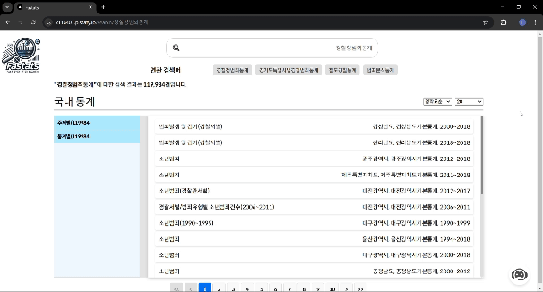

# 📋 프로젝트명 : Fastats

> Fastats는 국가통계포털(KOSIS)에서 제공하는 데이터를 더욱 빠르고 정확하게 검색할 수 있도록 돕는 검색 시스템입니다.  
> 사용자는 자료의 목적을 말하기만 해도 챗봇이 키워드 혹은 통계 자료를 추천해 줍니다.  
> 이를 통해 복잡했던 대한민국 통계청 자료 검색이 더욱 쉽게 개선됩니다.

## 🎨 데모

- **배포 URL** : [https://k11a407.p.ssafy.io](https://k11a407.p.ssafy.io)
- **로그인 없이 데모 확인 가능**

## 📧 팀원 소개

| 팀원  | Email                       | GitHub                                     | 역할                        |
|-----|-----------------------------|--------------------------------------------|----------------------------|
| 권용수 | kwonwd52@gmail.com          | [@kwonwd](https://github.com/kwonwd)       | 프론트엔드, 백엔드, AI 개발 |
| 김민지 | qnsghdharo119.dev@gmail.com | [@minddong2](https://github.com/minddong2) | 백엔드 개발                 |
| 손영준 | glenn.syj@gmail.com         | [@glenn-syj](https://github.com/glenn-syj) | 백엔드, 인프라              |
| 송창용 | krca5877@gmail.com          | [@krca5876](https://github.com/krca5876)   | 인프라                      |
| 이주영 | rsb98759@gmail.com          | [@icodo98](https://github.com/icodo98)     | 백엔드, 인프라, 데이터 처리  |
| 허동민 | happycodingmin@gmail.com    | [@hurdong](https://github.com/hurdong)     | 백엔드 개발                 |

## 🚀 주요 기능

- 🚀 **데이터 전처리**: 약 25만 건의 통계표 데이터를 전처리하고 적재
- 🔄 **데이터 최신화**: Spring Batch를 사용하여 정기적으로 데이터 최신화 수행
- 🔍 **검색 기능**: Elasticsearch를 통한 Full-Text Search 구현
- 💬 **챗봇**: 사용자가 목적을 입력하면 관련 키워드 및 통계 자료 추천

## 📄 사용 기술 스택

- **FE**: Next.js (w/ Typescript)
- **BE**: Spring Boot (w/ Java 17), Spring Scheduler, Spring Batch, Spring Data JDBC/Elasticsearch/JPA(비교용), Elasticsearch, Logstash, Kibana, MySQL, MongoDB, Redis
- **Infra**: Docker, Docker Compose, Docker Hub, Jenkins, NginX
- **AI** : Spring AI, Ollama

## 🔍 기술 선택 배경

### Elasticsearch 채택 이유

Elasticsearch는 **대량의 텍스트 데이터에 대한 빠른 검색 및 분석**을 가능하게 하는 오픈소스 검색 엔진으로, 프로젝트의 요구 사항에 적합한 몇 가지 주요 장점이 있어 채택하게 되었습니다:

1. **빠른 검색 성능**:
    - 국가통계포털의 데이터는 방대한 양의 통계 표로 구성되어 있어 이를 빠르게 검색하는 것이 중요했습니다. Elasticsearch는 **역색인 구조**를 통해 빠른 Full-Text Search를 제공하여 사용자가 필요한 정보를 신속하게 조회할 수 있게 했습니다.

2. **유연한 데이터 처리**:
    - Elasticsearch는 정형 데이터뿐만 아니라 비정형 데이터도 효율적으로 처리할 수 있어 **다양한 형태의 데이터**를 통합하여 검색하는 데 유리했습니다. 이는 통계 자료와 같이 다양한 형태로 존재하는 데이터를 다루는 데 큰 장점이 되었습니다.

3. **한국어 분석기 Nori의 지원**:
    - 한국어 검색 최적화를 위해 **Nori 분석기**를 사용했습니다. 이는 한국어의 형태소 분석에 최적화되어 있어 **대한민국 국민을 주요 사용자로 하는 통계청 데이터의 검색 성능**을 크게 향상시켰습니다.

4. **확장성**:
    - Elasticsearch는 **분산형 아키텍처**를 기반으로 하여 확장성이 뛰어납니다. 데이터 양이 증가해도 여러 노드에 데이터를 분산 저장하고, 성능 저하 없이 검색을 유지할 수 있습니다. 이 확장성은 향후 국가통계포털의 데이터가 증가할 것을 대비해 중요한 요소였습니다.

5. **Kibana와의 통합 가능성**:
    - 시각화를 위해 **Kibana**와 쉽게 통합할 수 있다는 점도 Elasticsearch를 선택한 이유 중 하나입니다. 검색된 데이터를 대시보드 형태로 시각화하여 사용자에게 더 나은 경험을 제공할 수 있었습니다.

이와 같은 이유로 **Elasticsearch**는 Fastats 프로젝트의 **빠르고 효율적인 검색 기능**과 **한국어 지원**을 가능하게 해주는 중요한 기술로 채택되었습니다.

## 📊 ERD (Entity Relationship Diagram)

## 🔍 아키텍처

- **Next.js**: 클라이언트 측 UI 렌더링
- **Spring Boot**: 백엔드 비즈니스 로직 및 API 제공
- **Elasticsearch**: 데이터 검색 및 검색어 자동 완성 기능

# 🛠️ 기능 설명 & 화면 구성

## 1. 랜딩 페이지
- **설명**: 전처리된 약 25만개의 통계청 데이터를 검색할 수 있는 화면을 제공합니다. 기존 KOSIS 통계청의 검색 속도보다 훨씬 빠른 속도를 경험할 수 있습니다.
- 

## 2. 검색어 제안
- **설명**: 해당 검색어의 오타를 검출하거나 해당 검색어와 유사한 검색어를 추천합니다.
- 

## 3. 카테고리 분류
- **설명**: 카테고리에 알맞게 데이터를 정렬합니다.
- 

## 4. 대분류 분류
- **설명**: 통계표의 주제 혹은 통계 기관에 따라 분류합니다.
- 

## 5. 챗봇 기능
- **설명**: 사용자의 입력에 따라 챗봇이 추천 검색어를 제시합니다.
- 

## 📈 향후 업데이트 계획

- 🌟 **V2 기능 추가**: 사용자 맞춤 추천 기능 추가
- 🚀 **API 최적화**: 검색 및 응답 시간 개선을 목표로 성능 최적화 진행

## 역할 분담

| 팀원    | 주요 담당 업무 |
|---------|---------------|
| **권용수**  | -  |
| **김민지**  | -  |
| **손영준**  | - |
| **송창용**  | -  |
| **이주영**  | -  |
| **허동민**  | - 성능 개선 로직 설계 및 구현  - Nori 분석기를 활용한 검색 기능 최적화  - 사용자 경험 개선을 위한 데이터 처리 로직 개발 |

## 🗒️ 느낀 점

| 팀원    | 느낀 점 |
|---------|---------|
| **권용수**  | -  짧은 개발 기간 때문에 아쉬움이 남는 프로젝트였습니다. 특히 빠르게 끝내줬어야할 데이터 전처리헤 생각보다 시간을 잡아먹혀서 다른 팀원들에게 조금 미안합니다. 그래도 다들 재촉하지 않고 자신이 맡은 부분을 빠르게 완성해 주어서 좋았습니다.|
| **김민지**  | -  |
| **손영준**  | -  |
| **송창용**  | -  |
| **이주영**  | -  |
| **허동민**  | - 성능 개선 프로젝트를 경험하면서 실사용이 가능한 고도화된 웹서비스를 배포 및 유지보수하는 전략의 중요성을 배웠습니다. - 엘라스틱 서치의 한국어 맞춤 분석기인 Nori를 사용하여 사용자 경험을 개선할 수 있었으며, JPA나 JDBC와 다른 방식으로 데이터를 처리하는 경험을 통해 새로운 성능 개선 포인트를 찾았습니다. |

---

